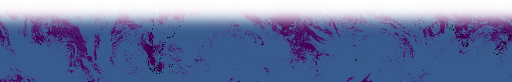

# Team X - Title of project

This is the place to host the things your team makes during the hackathon.

Here are some links we thought might be relevant, to get you started:
- ...

Below is a suggested structure for the README - if you end up with a lot of material, it may be worth splitting into multiple files.

## Introduction

## Usage instructions (if applicable)

## Detailed explanation

## Conclusions

## Follow ons

